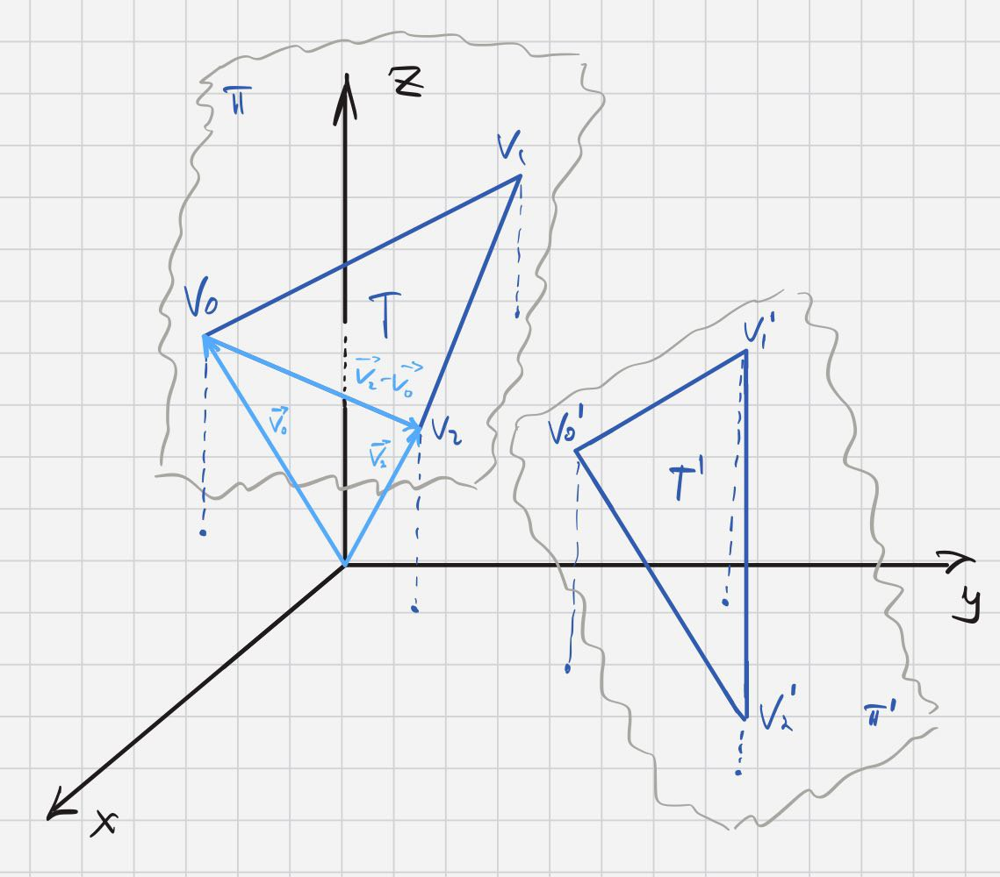
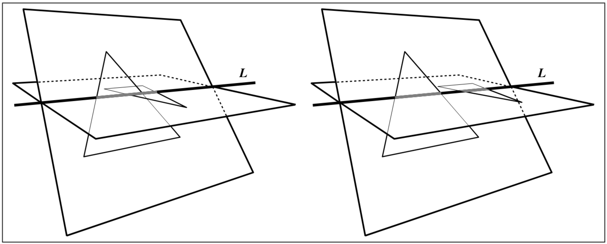
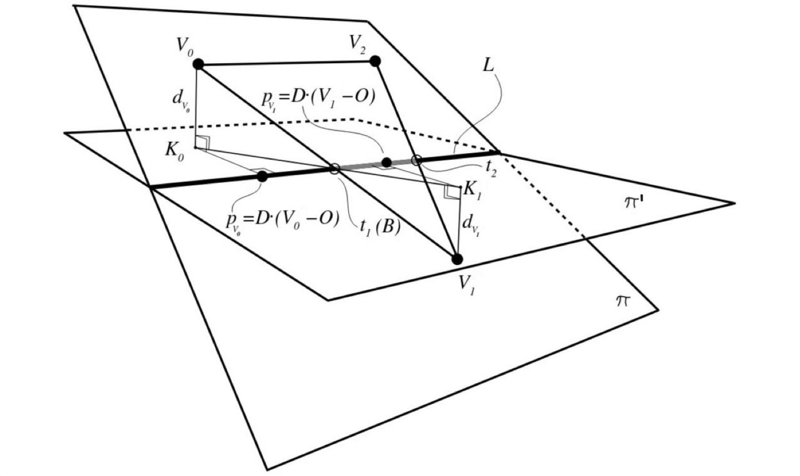

# 3D Треугольники

## Задача

Со стандартного ввода приходит число $0 < N < 1000000$, а потом $N$ наборов
точек, представляющих трёхмерные треугольники. Необходимо вывести номера
всех треугольников, которые пересекаются с каким-либо другим.

## Решение

За основу взят алгоритм, описанный Томасом Мёллером (Tomas Möller) в [данном](http://web.stanford.edu/class/cs277/resources/papers/Moller1997b.pdf) документе. Предоставлю ниже вольную трактовку данной статьи со своими дополнениями, но и с пропуском некоторого материала из статьи.

В решении буду использовать следующие обозначения:

* $\left( x, y, z \right)$ - вектор (точка) с соответствующими координатами
* $\left(\vec{X}, \vec{Y}\right)$ - скалярное произведение двух векторов
* $\left[\vec{X}, \vec{Y} \right]$ - векторное произведение двух векторов

Обозначим два треугольника за $T$ и $T'$. Вершины $T$ и $T'$ обозначим за $V_0, V_1, V_2$ и $V_0', V_1', V_2'$ соответственно. Плоскости, в которых лежат треугольники, обозначим за $\pi$ и $\pi'$.

  

Пусть плоскость $\pi$ задана уравнением $Ax + By + Cz + D = 0$. Перепишем это уравнение в более удобном для нас виде:

$$
\pi: Ax + By + Cz + D = 0 \Rightarrow
$$
$$
\pi: (A,B,C) \cdot (x,y,z) + D = 0 \Rightarrow
$$
$$
\pi: (\vec{N}, \vec{X}) + d = 0, где
$$

* $\vec{N} = \left[\vec{V_1} - \vec{V_0}, \vec{V_2} - \vec{V_0}\right]$ - нормаль к плоскости $\pi$,

* $X \in \pi$ - произвольная точка,

* $d = -\left(\vec{N}, \vec{V_0}\right)$.

Найдем расстояния от треугольника $T'$ до плоскости $\pi$. Для этого просто подставим вершины треугольника $T'$ в уравнение плоскости $\pi$:

$d_{V_i'} := \rho \left(\vec{V_i'}, \pi \right) = \left(\vec{N}, \vec{V_i'} \right) + d, i = 0, 1, 2$

#### Случай 1: один из треугольников не пересекает плоскость другого
Если все $d_{V_i'} \neq 0$ (то есть точки не лежат на плоскости), и все имеют один и тот же знак, тогда $T'$ лежит по одну сторону от $\pi$ и, значит, **треугольники не пересекаются**. То же верно для треугольника $T$ и плоскости $\pi'$.

Эта проверка позволяет избежать большого количества вычислений для некоторых пар треугольников.

#### Случай 2: треугольники лежат в одной плоскости

Если же все $d_{V_i'} = 0$, то треугольники лежат в одной плоскости.

В таком случае сначала проверяются все ребра $T$​ на пересечение с ребрами $T'$​. Если какое-либо пересечение найдено, то треугольники пересекаются.
В противном случае мы должны проверить, содержится ли $T$​ полностью в $T'$ или наоборот.

#### Случай 3: вершина одного из треугольников лежит внутри другого

Чтобы полноценно перейти к следующему случаю, нужно рассмотреть ситуацию, когда хотя бы одна вершина какого-либо треугольника лежит внутри другого треугольника. Это важно, потому что на следующем шаге мы хотим считать, что две вершины одного треугольника лежат по одну сторону от линии пересечения плоскостей, а оставшаяся вершина лежит по другую сторону.

#### Случай 4: общий
Иначе, пересечение плоскостей $\pi$ и $\pi'$ - это линия, которая задается уравнением $L = O + tD$, где $D = \left[\vec{N}, \vec{N'}\right]$ - направление линии, а O - некоторая точка на ней. Важно, что оба треугольника пересекают эту линию, благодаря отсечению случаев, рассмотренных ранее. Эти пересечения образуют интервалы на L, и если эти интервалы пересекаются, треугольники также пересекаются. На рисунке ниже показаны две возможные ситуации.

  

Интервалы пересечения отмечены серым цветом на обоих рисунках. Слева: интервалы на L пересекаются, а значит пересекаются и треугольники. Справа: интервалы не пересекаются, треугольники тоже.

Теперь мы хотим найти отрезок (на прямой L), который представляет пересечение треугольника $T$ с прямой L. Считаем, что вершины $V_0$ и $V_2$ лежат по одну сторону от плоскости $\pi'$, а вершина $V_1$ - по другую сторону.

Для начала спроецируем вершины на прямую L. За $p_{V_i}$ обозначим параметр $t$ проекции $V_i$ на прямую L. $p_{V_i} = \left(\vec{D}, \left(\vec{V_i} - \vec{O}\right)\right)$.

  

Затем мы хотим вычислить значение параметра прямой $t_1$ для точки $B = \vec{V_0V_1} ∩ L = O + t_1D$ (B - точка пересечение ребра $V_0V_1$ с прямой L)

За $K_i$ обозначим проекцию $V_i$ на $\pi'$. Теперь заметим, что $\bigtriangleup V_0BK_0$ подобен $\bigtriangleup V_1BK_1$, поэтому $t_1 = p_{V_0} + \left(p_{V_1} - p_{V_0}\right) \cdot \frac{d_{V_0}}{d_{V_0} - d_{V_1}}$. 

Аналогично $t_2 = p_{V_2} + \left(p_{V_1} - p_{V_2}\right) \cdot \frac{d_{V_2}}{d_{V_2} - d_{V_1}}$. 

Такие же рассуждения проводятся для треугольника $T'$. Далее, если полученные интервалы пересекаются, то треугольники также пересекаются.

#### Оптимизация

Поскольку интервалы можно сдвигать без изменения результата проверки на пересечение, уравнение для $p_{V_i}$ можно упростить до:
$p_{V_i} = \left(\vec{D}, \vec{V_i}\right)$

Следовательно, вычислять $O$ не требуется.

<!-- t * vec1 - u * vec2 = begin2 - begin1 = vec_between_starts
t * segments_cross - u * [vec2 × vec2] = [vec_between_starts × vec2]
t * segments_cross = [vec_between_starts × vec2]
t * (segments_cross, segments_cross) = ([vec_between_starts × vec2], segments_cross) -->
